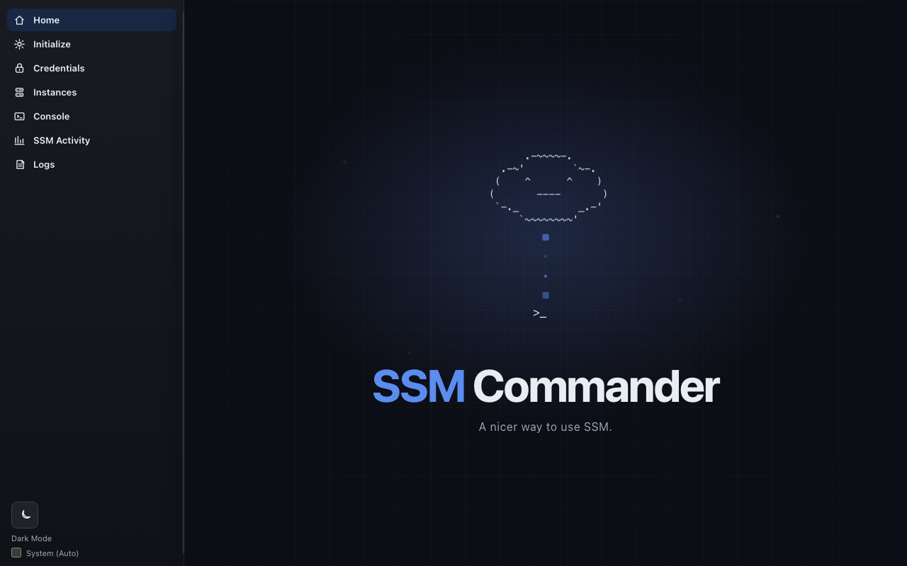

# SSM Commander

SSM Commander is a desktop app for browsing Amazon EC2 instances and launching
AWS Systems Manager workflows from a focused local interface. It complements
your existing AWS CLI and SSO setup; it does not replace IAM or manage AWS
credentials.



## Highlights

- Discover, save, validate, and switch among AWS CLI profiles.
- Browse EC2 instances and Systems Manager readiness by region.
- Start and stop instances and launch shell, SSH, RDP, and port-forward sessions.
- Store optional SSH/RDP connection details in an encrypted local vault.
- Use native embedded FreeRDP on macOS, including opt-in PIV/CAC redirection.

## Requirements

Every user needs:

- [AWS CLI v2](https://docs.aws.amazon.com/cli/latest/userguide/getting-started-install.html)
- [AWS Session Manager plugin](https://docs.aws.amazon.com/systems-manager/latest/userguide/session-manager-working-with-install-plugin.html)

Packaged macOS DMGs already include the FreeRDP and WinPR libraries used by the
native RDP renderer. Homebrew FreeRDP is a source-build dependency, not a
requirement for running a released DMG. OpenSSH and a configured RDP host are
needed only for their respective workflows.

## Quick start

Configure and authenticate an AWS profile, then start the app:

```sh
aws configure sso
aws sso login --profile your-profile
aws sts get-caller-identity --profile your-profile
```

Open SSM Commander, select the profile and region, and choose an instance.
The selected identity must have the AWS and instance-level permissions needed
for the action you want to run.

## Platform notes

macOS uses a native embedded FreeRDP view for RDP sessions and can share a
local PIV/CAC smart card with an established Windows desktop when you opt in.
Windows retains the legacy Guacamole embedded-RDP renderer; Docker is a
development dependency for that path, not a macOS DMG requirement. See the
[platform setup guide](docs/dependency-setup.md) for the details that apply to
your workflow.

## Security

AWS authentication and authorization stay with the selected AWS CLI profile.
Optional SSH/RDP credentials are encrypted in a local vault; manually entered
session secrets are memory-only. Read the full [security model](SECURITY.md)
before deploying the app in a sensitive environment.

## Documentation

- [Installation and dependency setup](docs/dependency-setup.md)
- [Development and contributing](CONTRIBUTING.md)
- [Troubleshooting](docs/troubleshooting.md)
- [Native macOS RDP and PIV/CAC](docs/macos-native-rdp-smartcard.md)
- [Release runbook](docs/releasing.md)
- [Release notes](CHANGELOG.md)

## License

SSM Commander is licensed under the [MIT License](LICENSE).
